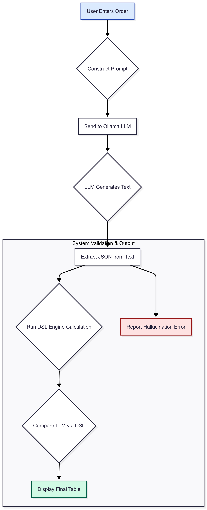

# LLM Validation with a DSL - Demo

This project demonstrates a system that uses a Domain-Specific Language (DSL) to validate and correct the output of a Large Language Model (LLM).

The goal is to show how a rules engine can act as a safety net, enforcing business logic on the structured data extracted by an LLM from a natural language query. This ensures the final output is both intelligent and compliant.

## The Rules Engine

This demo is built using the open-source `business-rules` library for Python.

* **Description:** It's a lightweight engine where rules are defined as data (JSON) and are completely separate from the execution code.
* **Format:** Rules consist of `conditions` (the "if" part) and `actions` (the "then" part). Our demo uses the `actions` to define calculation formulas.
* **Documentation:** For a full understanding of the library's capabilities, refer to the original repository: <https://github.com/venmo/business-rules>

---

## How to Use

### 1. Prerequisites: Install Ollama

This demo uses a locally-run open-source LLM. You must have Ollama installed and have downloaded the Llama 3 8B model.

1.  **Install Ollama:** Download from <https://ollama.com> and run the installer.
2.  **Download the Model:** Open a terminal and run:
    ```bash
    ollama pull llama3:8b
    ```

### 2. Setup the Python Environment

The demo runs inside a Jupyter Notebook. The following steps will set up the necessary Python environment.

1.  **Navigate to the Demo Folder:**
    ```bash
    cd demo_llm_validator
    ```
2.  **Create a Virtual Environment:**
    ```bash
    python -m venv venv
    ```
3.  **Activate the Environment:**
    * On Windows (PowerShell): `.\venv\Scripts\Activate.ps1`
    * On Mac/Linux: `source venv/bin/activate`
    *(Note: On PowerShell, you may first need to run `Set-ExecutionPolicy -ExecutionPolicy RemoteSigned -Scope Process`)*

4.  **Install Dependencies:**
    ```bash
    pip install -r requirements.txt
    ```

### 3. Run the Demo

1.  **Start the Jupyter Server:** In your active terminal, run:
    ```bash
    jupyter notebook
    ```
2.  **Open the Notebook:** A new tab will open in your browser. Click on `llm_validation_demo.ipynb`.
3.  **Run the Cells:** Execute each cell in the notebook in order by selecting it and pressing `Shift + Enter`. The final cell will display the interactive demo UI.

---

## Example Run-through: A Simple Tax Calculation System

The demo uses the scenario of calculating a restaurant bill according to a specific set of tax rules. \


The "source of truth" for the calculation is defined in our rules. The logic is contained in the `actions`.

```python
# From Cell 1 in the notebook
tax_calculation_rules = [
    {
        "name": "Calculate Food Tax (7%)",
        "conditions": { "all": [] },
        "actions": [
            {
                "name": "calculate_tax_on_variable",
                "params": {
                    "input_variable_name": "net_food_cost",
                    "tax_rate": 0.07,
                    "output_variable_name": "food_tax"
                }
            }
        ]
    },
    {
        "name": "Calculate Drink Tax (19%)",
        "conditions": { "all": [] },
        "actions": [
            {
                "name": "calculate_tax_on_variable",
                "params": {
                    "input_variable_name": "net_drink_cost",
                    "tax_rate": 0.19,
                    "output_variable_name": "drink_tax"
                }
            }
        ]
    },
    {
        "name": "Calculate Final Bill",
        "conditions": { "all": [] },
        "actions": [
            { "name": "calculate_total_bill" }
        ]
    }
]
```

The rules defined in JSON are connected to the actual Python code through a API contract (`business-rules` extension point type thing).

The library provides base classes (`BaseVariables`, `BaseActions`) and decorators (`@numeric_rule_variable`, `@rule_action`). These form the "contract" that our code must follow to be compatible with the rules engine.
The `BillVariables` and `BillActions` classes in the notebook are our specific implementation of this contract.
This `BillVariables` class implements the `BaseVariables` contract. Its purpose is to provide data to the engine. When a rule needs a value like `"net_food_cost"`, the engine looks for a method with the exact same name in this class.
This class implements the `BaseActions` contract. Its purpose is to execute the logic when a rule is triggered.

Let's look at the `"Calculate Food Tax (7%)"` rule's action:
```json
{
    "name": "calculate_tax_on_variable",
    "params": {
        "input_variable_name": "net_food_cost",
        "tax_rate": 0.07,
        "output_variable_name": "food_tax"
    }
}
```
* **`"name": "calculate_tax_on_variable"`**: This tells the engine to run the `calculate_tax_on_variable` method inside our `BillActions` class.
* **`"params"`**: This is a dictionary of arguments passed to that method.
    * **`"input_variable_name": "net_food_cost"`**: We pass the *name* of the variable as a string. Inside the Python method, we use this name to dynamically get the actual value (e.g., `30.00`) from the `BillVariables` class. This makes our `calculate_tax_on_variable` action reusable for both food and drinks.
    * **`"tax_rate": 0.07`**: This is a direct value passed to the method.
    * **`"output_variable_name": "food_tax"`**: We pass a string name to tell the method where to store the result of its calculation (e.g., `30.00 * 0.07 = 2.10`). The method stores this result in a dictionary like `{'food_tax': 2.10}`.

This structure powerfully separates the *what* (the logic in the JSON rules) from the *how* (the implementation in the Python code).

### Adding New Rules (A High-Level Guide)

Extending the system for a new domain involves two main steps: defining the new rules in the DSL, and implementing the corresponding logic in the Python classes.

**Step 1: Define the New Rule in the DSL (The "What")**
First, you define the new business logic by adding a new JSON object to the rules list. For example, to add a service tip, you would add this rule:

```json
{
    "name": "Add Service Tip",
    "conditions": { "all": [] },
    "actions": [
        {
            "name": "add_tip_to_total",
            "params": {
                "tip_variable_name": "service_tip"
            }
        }
    ]
}
```

**Step 2: Implement the Logic in Python (The "How")**
Next, you implement the new variable (`service_tip`) and the new action (`add_tip_to_total`) in the Python classes so the engine knows how to execute the rule.

1.  **Add the new variable** to the `BillVariables` class:
    ```python
    @numeric_rule_variable
    def service_tip(self):
        return self.data.get('service_tip', 0)
    ```
2.  **Add the new action** to the `BillActions` class:
    ```python
    @rule_action(params=[{'fieldType': 'text', 'name': 'tip_variable_name'}])
    def add_tip_to_total(self, tip_variable_name):
        tip_amount = getattr(self.variables, tip_variable_name)()
        self.final_bill += tip_amount
    ```

### The LLM Prompt

When the user enters an order, the system constructs a detailed prompt asking the LLM to both extract the base costs and attempt the full calculation.

```python
# From Cell 4 in the notebook
prompt = f"""
You are a restaurant billing assistant. Your tasks are:
1. Extract the 'net_food_cost' and 'net_drink_cost' from the user's order.
2. Attempt to calculate the 'total_tax' (food tax is 7%, drink tax is 19%).
3. Attempt to calculate the 'final_bill'.
4. Respond ONLY with a JSON object containing these four fields.

User Order: "{user_query}"

JSON Response:
"""
```



1.  **LLM Processing:** The user's order is sent to the local Ollama LLM with the prompt above.
2.  **JSON Extraction:** The system's code intelligently finds and parses the JSON block from the LLM's (potentially messy) text response.
3.  **DSL Engine Calculation:** The system uses the `BillActions` class to execute the formulas defined in our `tax_calculation_rules` on the data extracted by the LLM. This produces a separate, guaranteed-correct calculation.
4.  **Comparison:** The final output is a table that shows a side-by-side comparison of the LLM's calculated values and the DSL-enforced values, with a status icon for each line item.
